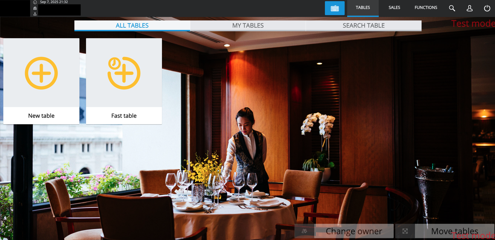

# Show All Tables Plugin

A small plugin for [SAP Customer Checkout](https://www.sap.com/products/customer-checkout.html) that makes **"All tables"** the default view of the table overview instead of "My tables".

By default the POS opens the table overview on the "My tables" tab, which only shows tables owned by the logged-in cashier. In many restaurants every waiter serves every table — this plugin switches the overview to "All tables" whenever the tab bar is built (after login and whenever the table overview reloads), so nobody has to tap the tab first.



## Installation

1. Download `show-all-tables-plugin-<version>.jar` from the [latest release](https://github.com/stefanbaust/cco-show-all-tables-plugin/releases).
2. Copy it into the plugin folder of the POS (`POSPlugins/AP/` inside the Customer Checkout installation directory).
3. Restart Customer Checkout and activate the plugin under *Configuration → Plugins*.

The plugin has no configuration — installed and active means "All tables" is the default.

## Compatibility

| | |
|---|---|
| SAP Customer Checkout | 2.0 FP21, cloud edition 3.0 FP2502–FP2602 |
| Java | 17 |

The supported feature packs are declared in the jar manifest (`cashDeskVersions`); the POS plugin manager ignores plugins that do not list its own version.

## How it works

The Java class only registers the plugin and injects `showAllTablesPlugin.js` into the POS UI (NGUI). The script hooks the `tableOverviewModifyTabs` plugin exit and selects the first view ("All tables") whenever the table overview builds its tabs.

## Building

```bash
mvn verify -s .mvn/settings.xml
```

The SAP `ENV` dependency (the Customer Checkout runtime API, `provided` scope) is not publicly available; the checked-in `.mvn/settings.xml` resolves it from a private repository using the `MAVEN_REPO_USERNAME` / `MAVEN_REPO_PASSWORD` environment variables. Without access to such a repository the plugin cannot be built from source — this unfortunately also means CI cannot build pull requests from forks.

## License

[MIT](LICENSE)
